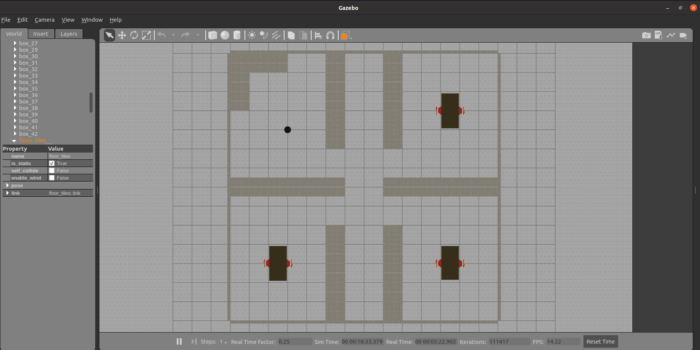
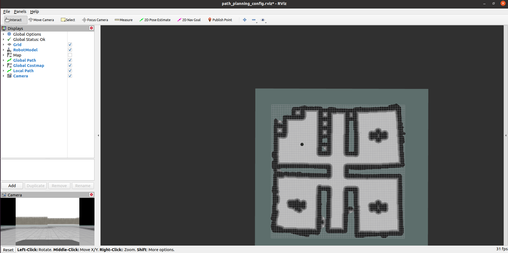
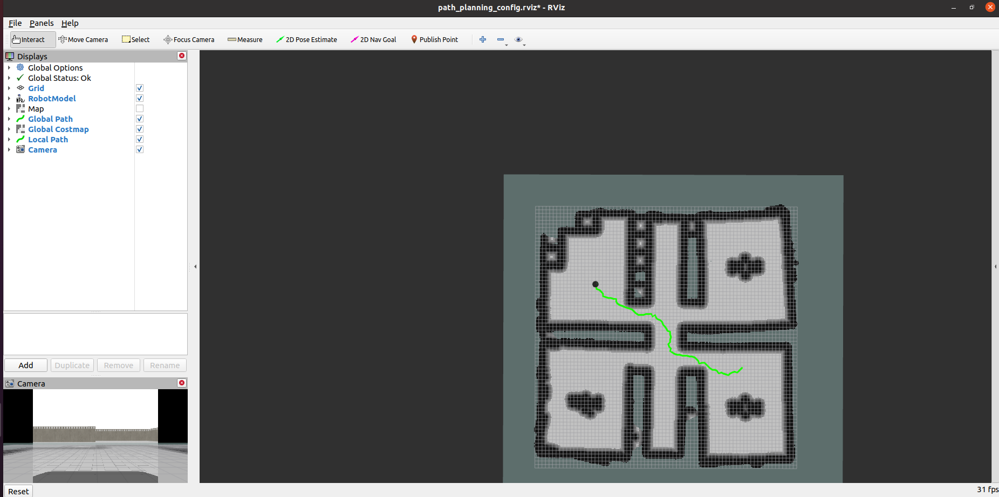

# Autonomously-Navigating-a-Robot-using-RRT-Path-Planning-algorithm-in-ROS
The project includes a robot being spawned in a restaurant world. The robot travels autonomously around the restaurant using the map developed and move_base package of ROS which uses the RRT algorithm for path plannning.

### To run the code in your machine, following are the steps :- 
1. Close the repository in your machine.
2. Copy the packages in your workspace.
3. Terminal 1 - catkin_make
4. Terminal 1 - source devel/setup.bash
5. Terminal 1 - roslaunch path_planning simulation.launch
6. Terminal 2 - roslaunch path_planning plan_path.launch
7. Give a goal location using "2D Nav Goal" option in RViz

### Restaurant World 

### RViz window 

### RViz window with planned path

### References :- 
1. https://github.com/AtsushiSakai/PythonRobotics
2. https://www.theconstructsim.com/develop-the-robots-of-the-future/
